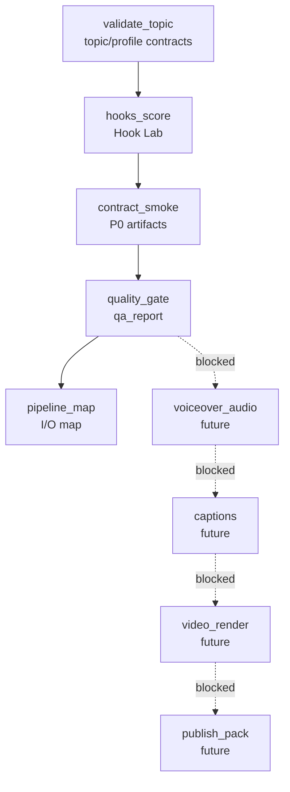

# Attention Is All You Need 改变了什么 Pipeline Map

Episode: `ep01_attention_is_all_you_need`

Generated at: `1970-01-01T00:00:00.000Z`

Dagu workflow: `dagu/ai-paper-content-factory-ep01.yaml`

## Flow

## Stage I/O

| Stage | Status | Inputs | Outputs | Command | Blocking Items |
|---|---|---|---|---|---|
| validate_topic | PASS | ok episodes/ep01_attention_is_all_you_need/topic.yaml ok pipelines/episode.schema.json ok data/hook_patterns.yml ok platform_profiles/douyin.zh-CN.yaml ok platform_profiles/xiaohongshu.zh-CN.yaml ok platform_profiles/bilibili.zh-CN.yaml ok platform_profiles/youtube-shorts.en-US.yaml ok platform_profiles/youtube-long.en-US.yaml ok platform_profiles/x.en-US.yaml | - | npm run validate:topic | - |
| hooks_score | PASS | ok episodes/ep01_attention_is_all_you_need/topic.yaml ok data/hook_patterns.yml ok platform_profiles/douyin.zh-CN.yaml ok platform_profiles/xiaohongshu.zh-CN.yaml ok platform_profiles/bilibili.zh-CN.yaml ok platform_profiles/youtube-shorts.en-US.yaml ok platform_profiles/youtube-long.en-US.yaml ok platform_profiles/x.en-US.yaml | ok script/hooks.json ok storyboard/hook_variants.json ok qa/hook_report.json | npm run hooks:score | - |
| contract_smoke | PASS | ok episodes/ep01_attention_is_all_you_need/topic.yaml ok data/hook_patterns.yml ok platform_profiles/douyin.zh-CN.yaml ok platform_profiles/xiaohongshu.zh-CN.yaml ok platform_profiles/bilibili.zh-CN.yaml ok platform_profiles/youtube-shorts.en-US.yaml ok platform_profiles/youtube-long.en-US.yaml ok platform_profiles/x.en-US.yaml | ok research/sources.jsonl ok research/claims.json ok research/timeline.json ok script/voiceover.md ok script/voice_segments.json ok storyboard/storyboard.json ok voice/voice_profile_manifest.json ok voice/enrollment/recording_needed.md ok review/human_review.md ok blog/blog.md | npm run episode:contract-smoke | - |
| quality_gate | PARTIAL | ok script/hooks.json ok storyboard/hook_variants.json ok qa/hook_report.json ok research/sources.jsonl ok research/claims.json ok research/timeline.json ok script/voiceover.md ok script/voice_segments.json ok storyboard/storyboard.json ok voice/voice_profile_manifest.json ok voice/enrollment/recording_needed.md ok review/human_review.md ok blog/blog.md | ok qa/qa_report.json | npm run quality:gate | Not verified runtime artifact: audio/voiceover.wav Not verified runtime artifact: captions/subtitles.srt Not verified runtime artifact: renders/douyin_zh_1080x1920_draft.mp4 Not verified runtime artifact: publish/publish_pack.md |
| pipeline_map | PASS | ok qa/qa_report.json ok qa/hook_report.json | ok qa/pipeline_map.json ok qa/pipeline_map.md | npm run pipeline:map | - |
| voiceover_audio | BLOCKED | ok script/voiceover.md ok voice/voice_profile_manifest.json | missing audio/voiceover.wav | future: personal voice or built-in TTS | Not verified runtime artifact: audio/voiceover.wav Missing output: audio/voiceover.wav |
| captions | BLOCKED | ok script/voice_segments.json missing audio/voiceover.wav | missing captions/subtitles.srt | future: caption alignment | Not verified runtime artifact: captions/subtitles.srt Missing input: audio/voiceover.wav Missing output: captions/subtitles.srt |
| video_render | BLOCKED | ok storyboard/storyboard.json missing audio/voiceover.wav missing captions/subtitles.srt | missing renders/douyin_zh_1080x1920_draft.mp4 | future: HyperFrames/Manim render | Not verified runtime artifact: renders/douyin_zh_1080x1920_draft.mp4 Missing input: audio/voiceover.wav Missing input: captions/subtitles.srt Missing output: renders/douyin_zh_1080x1920_draft.mp4 |
| publish_pack | BLOCKED | missing renders/douyin_zh_1080x1920_draft.mp4 ok qa/qa_report.json | missing publish/publish_pack.md | future: platform packaging | Not verified runtime artifact: publish/publish_pack.md Missing input: renders/douyin_zh_1080x1920_draft.mp4 Missing output: publish/publish_pack.md |

## Summary

- Status: `partial`
- Passed stages: 4
- Partial stages: 1
- Failed stages: 0
- Blocked future stages: 4
