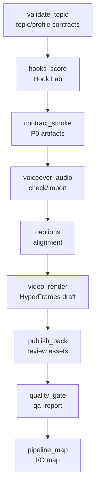

# Attention Is All You Need 改变了什么 Pipeline Map

Episode: `ep01_attention_is_all_you_need`

Generated at: `1970-01-01T00:00:00.000Z`

Dagu workflow: `dagu/ai-paper-content-factory-ep01.yaml`

## Flow

## Stage I/O

| Stage | Status | Inputs | Outputs | Command | Blocking Items |
|---|---|---|---|---|---|
| validate_topic | PASS | ok episodes/ep01_attention_is_all_you_need/topic.yaml ok pipelines/episode.schema.json ok data/hook_patterns.yml ok platform_profiles/douyin.zh-CN.yaml ok platform_profiles/xiaohongshu.zh-CN.yaml ok platform_profiles/bilibili.zh-CN.yaml ok platform_profiles/youtube-shorts.en-US.yaml ok platform_profiles/youtube-long.en-US.yaml ok platform_profiles/x.en-US.yaml | - | npm run validate:topic | - |
| hooks_score | PASS | ok episodes/ep01_attention_is_all_you_need/topic.yaml ok data/hook_patterns.yml ok platform_profiles/douyin.zh-CN.yaml ok platform_profiles/xiaohongshu.zh-CN.yaml ok platform_profiles/bilibili.zh-CN.yaml ok platform_profiles/youtube-shorts.en-US.yaml ok platform_profiles/youtube-long.en-US.yaml ok platform_profiles/x.en-US.yaml | ok script/hooks.json ok storyboard/hook_variants.json ok qa/hook_report.json | npm run hooks:score | - |
| contract_smoke | PASS | ok episodes/ep01_attention_is_all_you_need/topic.yaml ok data/hook_patterns.yml ok platform_profiles/douyin.zh-CN.yaml ok platform_profiles/xiaohongshu.zh-CN.yaml ok platform_profiles/bilibili.zh-CN.yaml ok platform_profiles/youtube-shorts.en-US.yaml ok platform_profiles/youtube-long.en-US.yaml ok platform_profiles/x.en-US.yaml | ok research/sources.jsonl ok research/claims.json ok research/timeline.json ok script/voiceover.md ok script/voice_segments.json ok storyboard/storyboard.json ok voice/voice_profile_manifest.json ok review/human_review.md ok blog/blog.md | npm run episode:contract-smoke | - |
| voiceover_audio | PASS | ok script/voiceover.md ok voice/voice_profile_manifest.json | ok audio/voiceover.wav | npm run voiceover:check | - |
| captions | PASS | ok script/voice_segments.json ok audio/voiceover.wav | ok captions/subtitles.srt | npm run captions:align | - |
| video_render | PASS | ok storyboard/storyboard.json ok audio/voiceover.wav ok captions/subtitles.srt | ok renders/hyperframes/ep01_draft.html ok renders/douyin_zh_1080x1920_draft.mp4 | npm run video:hyperframes-draft | - |
| publish_pack | PASS | ok renders/douyin_zh_1080x1920_draft.mp4 ok qa/qa_report.json | ok publish/publish_pack.md | npm run publish:pack | - |
| quality_gate | PASS | ok script/hooks.json ok storyboard/hook_variants.json ok qa/hook_report.json ok research/sources.jsonl ok research/claims.json ok research/timeline.json ok script/voiceover.md ok script/voice_segments.json ok storyboard/storyboard.json ok voice/voice_profile_manifest.json ok review/human_review.md ok blog/blog.md | ok qa/qa_report.json | npm run quality:gate | - |
| pipeline_map | PASS | ok qa/qa_report.json ok qa/hook_report.json | ok qa/pipeline_map.json ok qa/pipeline_map.md | npm run pipeline:map | - |

## Summary

- Status: `pass`
- Passed stages: 9
- Partial stages: 0
- Failed stages: 0
- Blocked future stages: 0
